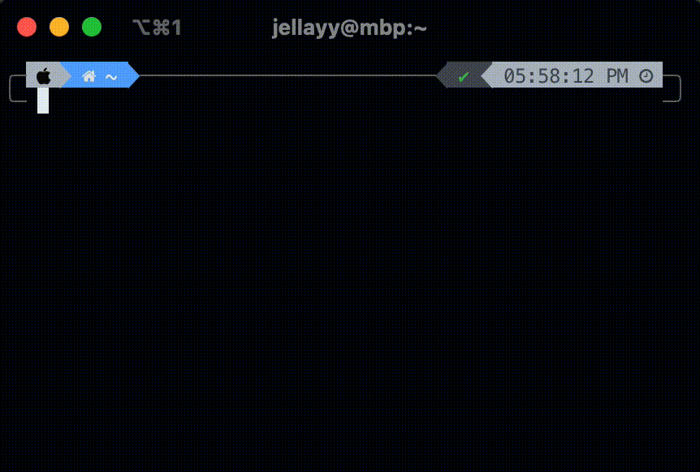

```
                          ____
 _      ______  _________/ / /__  _____
| | /| / / __ \/ ___/ __  / / _ \/ ___/
| |/ |/ / /_/ / /  / /_/ / /  __/ /
|__/|__/\____/_/   \__,_/_/\___/_/
```

go-based CLI toolkit for the New York Times' hit game: Wordle

## Demo



## Installation

### Prebuilt Download

To grab the latest release, head over to the [releases](https://github.com/Jellayy/wordler/releases) tab and download the build for your platform.

To easily access wordler in your terminal, add it somewhere in your path. The process varies between platforms:
```bash
sudo chmod +x wordler-1.0.0-darwin-amd64
mv wordler-1.0.0-darwin-amd64 /usr/local/bin/wordler
```

### Build from source

If you have your go environment setup, building wordler from source is easy:
```bash
git clone https://github.com/Jellayy/wordler.git
cd wordler
go build -o wordler main.go
```

## Usage

wordler is built on [cobra](https://github.com/spf13/cobra) and works similarly to other CLI tools that you've probably used before, like the GitHub CLI.

Use `-h` anywhere to get more info and usage examples for commands

```bash
wordler play -h
```
```
Play a game of Wordle in the command line

Usage:
  wordler play [flags]

Flags:
  -g, --gamemode string   Choose gamemode, available options: nytdaily, random
  -h, --help              help for play
```

## Extra Info

The New York Times' wordle wordset is based on the [CSW19 Set](https://en.wikipedia.org/wiki/Collins_Scrabble_Words) with some additions totaling 14,855 words compared to the 12,972 5-letter words that are in the original dataset. The New York Times' dataset was pulled from the wordle source on 9/11/2023 and can be found at `datasets/NYT.csv`
